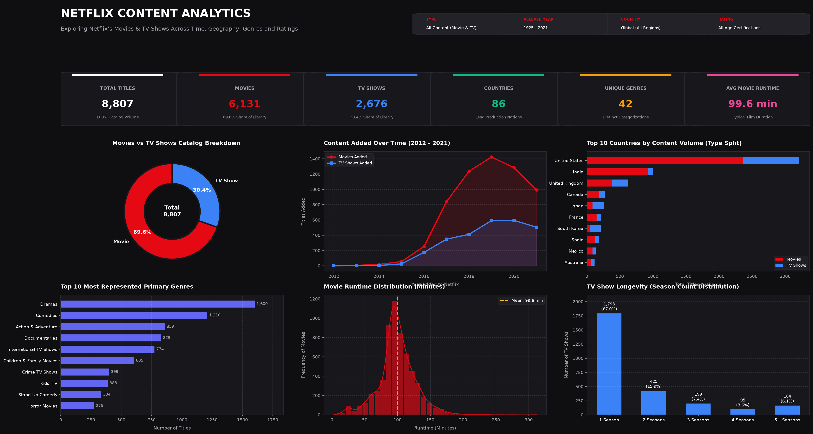

# Netflix Shows & Movies Analytics

An end-to-end data analytics portfolio project examining 8,807 Netflix titles across temporal, geographic, categorical, and maturity dimensions. Built using **SQL**, **Microsoft Excel**, and **Tableau**, this project provides a data-backed evaluation of Netflix's content acquisition, format composition, and international expansion strategy.

---

## Dashboard Preview



*Interactive Tableau Dashboard (`Tableau/Netflix_Content_Analytics.twbx`): Executive KPI scorecard, annual content ingestion trajectory, regional production volume by content type, genre distribution, runtime histogram, and series longevity.*

---

## Table of Contents
1. [Project Overview](#project-overview)
2. [Business Objectives](#business-objectives)
3. [Dataset & Schema](#dataset--schema)
4. [Tools & Technologies](#tools--technologies)
5. [Data Cleaning & Transformation](#data-cleaning--transformation)
6. [SQL Analytics Architecture](#sql-analytics-architecture)
7. [Excel Modeling & Exploratory Analysis](#excel-modeling--exploratory-analysis)
8. [Tableau Business Intelligence Dashboard](#tableau-business-intelligence-dashboard)
9. [Key Analytical Findings](#key-analytical-findings)
10. [Repository Structure](#repository-structure)
11. [Skills Demonstrated](#skills-demonstrated)
12. [How to Run the Project](#how-to-run-the-project)
13. [Future Scope](#future-scope)

---

## Project Overview
Over the past decade, Netflix evolved from a domestic DVD rental service into the world's leading subscription video-on-demand platform. Understanding the composition, longevity, and geographic origin of its catalog offers critical insights into digital entertainment strategy, content licensing investments, and audience segmentation.

This repository conducts a comprehensive audit of **8,807 titles** (6,131 Movies and 2,676 TV Shows), solving 21 analytical business questions using modular SQL scripts, developing a structured 5-sheet financial/operational Excel workbook, and deploying an interactive executive Tableau dashboard.

---

## Business Objectives
* **Catalog Allocation**: Quantify the historical balance between standalone feature films and serialized television series.
* **Ingestion Momentum**: Identify peak content acquisition periods and measure year-over-year growth trajectories.
* **Geographic Production**: Map lead production countries, assess international co-production networks, and identify regional format preferences.
* **Format Longevity & Duration**: Benchmark movie running times and evaluate episodic renewal rates across seasons.
* **Demographic Targeting**: Profile maturity ratings and audience suitability distributions across content formats.
* **Content Freshness**: Measure the time lag between original theatrical/broadcast premiere and platform debut.

---

## Dataset & Schema
* **Source**: Public Kaggle Netflix Movies & TV Shows Dataset (collected via public metadata and Netflix API endpoints).
* **Raw Records**: 8,807 titles, 12 attributes.
* **Cleaned Records**: 8,807 titles, 20 attributes (100% record retention).
* **Temporal Span**: Original release years ranging from 1925 to 2021; platform additions from 2008 to 2021.

### Data Model Architecture
```
+-----------------------------------------------------------------------------------+
|                                  netflix_titles                                   |
+-----------------------------------------------------------------------------------+
| PK show_id            VARCHAR(10)  | primary_country     VARCHAR(100)             |
|    type               VARCHAR(10)  | date_added          DATE                     |
|    title              VARCHAR(255) | year_added          INTEGER                  |
|    director           TEXT         | release_year        INTEGER                  |
|    cast               TEXT         | rating              VARCHAR(20)              |
|    country            VARCHAR(255) | rating_category     VARCHAR(50)              |
|    duration           VARCHAR(50)  | duration_minutes    INTEGER (Movies)         |
|    listed_in          VARCHAR(255) | duration_seasons    INTEGER (TV Shows)       |
|    primary_genre      VARCHAR(100) | description         TEXT                     |
+------------------------------------+----------------------------------------------+
         |                                |                        |
         | 1:N                            | 1:N                    | 1:N
         v                                v                        v
+-----------------------+   +------------------------+   +--------------------+
|   netflix_directors   |   |      netflix_cast      |   |  netflix_countries |
+-----------------------+   +------------------------+   +--------------------+
| PK director_id  INT   |   | PK cast_id       INT   |   | PK country_id  INT |
| FK show_id      FK    |   | FK show_id       FK    |   | FK show_id     FK  |
|    director     TEXT  |   |    actor         TEXT  |   |    country     TEXT|
+-----------------------+   +------------------------+   +--------------------+
```

*For complete field definitions and business logic, refer to the [Data Dictionary](Dataset/data_dictionary.md).*

---

## Tools & Technologies
* **SQL (PostgreSQL / SQLite / MySQL compatible)**: Primary engine for data transformation, relational normalization, aggregations, CTEs, and window functions.
* **Microsoft Excel**: Data auditing, structured cross-tabulations, dynamic formulas (`COUNTIFS`, `AVERAGE`, `SUM`), data dictionary, and executive KPI scorecard.
* **Tableau Desktop / Public**: Interactive dashboard development, parameter filtering, visual encoding, and design system implementation.
* **Python (pandas, openpyxl, matplotlib, seaborn)**: Data cleaning automation, SQL test harness, and high-DPI dashboard visual rendering.

---

## Data Cleaning & Transformation

1. **Misplaced Column Shifts (Louis C.K. Records)**:
   * *Anomaly*: Rows `s5542`, `s5795`, and `s5814` had duration strings (`"74 min"`, `"84 min"`, `"66 min"`) erroneously recorded in the `rating` column while `duration` was `NaN`.
   * *Resolution*: Relocated duration strings to `duration`, extracted numerical minutes, and imputed ratings to `'NR'`.
2. **Missing Value Imputation**:
   * Imputed `director` (2,634 rows), `cast` (825 rows), and `country` (831 rows) with `'Unknown'` to retain 100% of rows for aggregate analysis.
   * Imputed 4 missing ratings and 3 unrated variants (`UR`) to standard `'NR'`.
3. **Date Standardization**:
   * Converted inconsistent string dates (e.g. `"September 25, 2021"`) into standard ISO `YYYY-MM-DD` dates.
   * Extracted `year_added`, `month_added`, and `month_name_added`.
4. **Duration Parsing**:
   * Extracted integer `duration_minutes` for Movies (NULL for TV Shows).
   * Extracted integer `duration_seasons` for TV Shows (NULL for Movies).
5. **Relational Normalization**:
   * Parsed comma-delimited strings to create 1-to-many lookup tables: `netflix_directors`, `netflix_cast`, `netflix_countries`, and `netflix_genres`.

---

## SQL Analytics Architecture

The SQL suite is organized into 5 modular, production-ready scripts in [`SQL/`](SQL/):

### [01_database_setup.sql](SQL/01_database_setup.sql)
Creates staging (`netflix_raw`), production (`netflix_titles`), and relational tables (`netflix_directors`, `netflix_cast`, `netflix_countries`, `netflix_genres`) with primary keys, foreign keys, and analytical indexes (`idx_type`, `idx_country`, `idx_release_year`).

### [02_data_cleaning.sql](SQL/02_data_cleaning.sql)
Performs data quality checks, duplicate identification, anomaly correction, and data insertion using `COALESCE`, `NULLIF`, and string parsing functions.

### [03_exploratory_analysis.sql](SQL/03_exploratory_analysis.sql)
Computes foundational descriptive statistics:
* Total catalog count and unique creator cardinality
* Movie vs TV Show percentage split
* Decade-by-decade release distributions
* Monthly addition seasonality

### [04_business_analysis.sql](SQL/04_business_analysis.sql)
Answers 21 core business questions using accurate representation terminology (*most represented*, *highest volume*):
* Peak acquisition years (2019 peak with 2,016 additions)
* Top content-producing nations (US: 2,818; India: 972; UK: 419)
* Movie-to-TV Show production ratios by country (India: 11.3:1 vs South Korea: 0.33:1)
* Series longevity distribution (67.0% of TV series are 1 Season only)
* Runtime distributions across decades
* Top 3 genres within major production hubs

### [05_advanced_analysis.sql](SQL/05_advanced_analysis.sql)
Demonstrates advanced analytical SQL techniques:
* **Window Functions**: `DENSE_RANK()`, `RANK()`, `ROW_NUMBER()` over partitioned windows.
* **Cumulative Additions**: Running total catalog growth using `SUM(...) OVER (...)`.
* **Year-over-Year Growth**: Computing annual addition velocity using `LAG(...) OVER (...)`.
* **Rolling Moving Averages**: 3-year smoothed addition trends.
* **Quartile Binning**: `NTILE(4)` runtime segmentation for feature films.

#### Highlight Query: Cumulative Catalog Additions & YoY Growth
```sql
WITH annual_additions AS (
    SELECT 
        year_added,
        COUNT(*) AS additions_count,
        SUM(CASE WHEN type = 'Movie' THEN 1 ELSE 0 END) AS movies_added,
        SUM(CASE WHEN type = 'TV Show' THEN 1 ELSE 0 END) AS tv_shows_added
    FROM netflix_titles
    WHERE year_added IS NOT NULL
    GROUP BY year_added
),
catalog_metrics AS (
    SELECT 
        year_added,
        additions_count,
        movies_added,
        tv_shows_added,
        SUM(additions_count) OVER (
            ORDER BY year_added 
            ROWS BETWEEN UNBOUNDED PRECEDING AND CURRENT ROW
        ) AS cumulative_catalog_size,
        LAG(additions_count, 1) OVER (ORDER BY year_added) AS prev_year_additions
    FROM annual_additions
)
SELECT 
    year_added,
    additions_count,
    movies_added,
    tv_shows_added,
    cumulative_catalog_size,
    ROUND(((additions_count - prev_year_additions) * 100.0) / NULLIF(prev_year_additions, 0), 2) AS yoy_growth_pct
FROM catalog_metrics
ORDER BY year_added ASC;
```

---

## Excel Modeling & Exploratory Analysis

The Excel workbook [`Excel/Netflix_Analytics.xlsx`](Excel/Netflix_Analytics.xlsx) contains 5 structured sheets:

| Sheet Name | Type | Contents & Features |
| :--- | :--- | :--- |
| **`KPI_Summary`** | Executive Dashboard | 6 KPI scorecard cards, annual ingestion trend table (2012–2021) with dynamic Excel formulas (`COUNTIFS`, `SUM`), YoY growth rates, and target audience maturity profile breakdown. |
| **`Pivot_Analysis`** | Analytical Cross-Tabs | Structured summary models: Top 15 production countries with Movie/TV splits, Top 15 primary genres, TV show longevity season distribution, and cumulative percentages. |
| **`Data_Dictionary`** | Metadata Documentation | Full technical schema specifications: field name, data type, role, null count, business definitions, and sample values. |
| **`Cleaned_Data`** | Production Table | Complete 8,807-row dataset with 20 cleaned attributes, alternating row striping, auto-filters, and formatted columns. |
| **`Raw_Data`** | Ingestion Baseline | Full 8,807-row raw dataset as originally imported, serving as an audit baseline. |

---

## Tableau Business Intelligence Dashboard

* **Workbook File**: [`Tableau/Netflix_Content_Analytics.twbx`](Tableau/Netflix_Content_Analytics.twbx) (Self-contained packaged workbook with embedded data source)
* **Workbook XML**: [`Tableau/Netflix_Content_Analytics.twb`](Tableau/Netflix_Content_Analytics.twb)
* **Export Preview**: [`Dashboard/netflix_dashboard.png`](Dashboard/netflix_dashboard.png)

### Dashboard Specifications
* **Visual Hierarchy**: Executive dark graphite theme (`#0F0F11` canvas, `#18181C` cards) with restrained Netflix red accents (`#E50914`).
* **KPI Scorecard**:
  * Total Titles: **8,807**
  * Movies: **6,131** (69.6% share)
  * TV Shows: **2,676** (30.4% share)
  * Lead Production Countries: **86**
  * Unique Primary Genres: **42**
  * Average Movie Runtime: **99.6 min**
* **Visual Components**:
  1. *Movies vs TV Shows*: Donut chart illustrating library allocation.
  2. *Content Added Over Time*: Dual-line trend chart showing volume ramp-up from 2012 to 2021.
  3. *Top 10 Countries*: Stacked horizontal bar chart detailing film vs series composition per nation.
  4. *Top 10 Genres*: Ranked horizontal bar chart highlighting leading catalog categories.
  5. *Movie Runtime Distribution*: Histogram with mean benchmark indicator (99.6 minutes).
  6. *TV Show Longevity*: Discrete season count distribution highlighting franchise continuation rates.
* **Interactive Filters**: Content Type, Release Year, Production Country, Content Rating.

---

## Key Analytical Findings

A brief summary of findings detailed in [`Insights/key_findings.md`](Insights/key_findings.md):

1. **Movie-Heavy Portfolio**: Movies constitute **69.6%** of titles, outnumbering TV shows by more than 2.29 to 1.
2. **2019 Addition Apex**: Platform ingestion surged exponentially from 2015 to peak in **2019 (2,016 additions)** before moderating in 2020 (1,879) and 2021 (1,498) due to pandemic production halts and catalog consolidation.
3. **Maturity Concentration**: Adult (`TV-MA`, `R`) and mature teen (`TV-14`, `PG-13`) titles account for **70.0%** of all content, with family/kids content representing under 10%.
4. **Geographic Leaders**: The US (2,818 primary titles) and India (972 primary titles) generate **43.0%** of the entire catalog.
5. **East Asian vs South Asian Regional Contrast**: India's catalog is **91.9% Movies**, whereas South Korea (**75.4% TV Shows**) and Japan (**68.2% TV Shows**) are dominated by episodic dramas and anime.
6. **TV Show Retention Bottleneck**: **67.0% of television shows (1,793 titles)** never progress beyond Season 1. Only **17.1%** reach 3 or more seasons.
7. **Runtime Standardization**: Feature films average **99.6 minutes**, with 50% of all movies falling between 87 and 114 minutes.
8. **Shift to Contemporary Premieres**: Lag time from theatrical debut to Netflix addition contracted from **7.4 years in 2012** to **1.8 years in 2021**, demonstrating Netflix's pivot from legacy syndication to first-window streaming premieres.

---

## Repository Structure

```
Netflix-Shows-and-Movies-Analytics/
├── Dataset/
│   ├── netflix_titles_raw.csv          # Unmodified 8,807-row raw dataset
│   ├── netflix_titles_cleaned.csv      # Standardized and enriched production dataset
│   ├── data_dictionary.md              # Column definitions, types, and cleaning rules
│   ├── relational_directors.csv        # Normalized 1:N directors table
│   ├── relational_cast.csv             # Normalized 1:N cast table
│   ├── relational_countries.csv        # Normalized 1:N countries table
│   └── relational_genres.csv           # Normalized 1:N genres table
│
├── SQL/
│   ├── 01_database_setup.sql           # DDL schema, staging, production, and index creation
│   ├── 02_data_cleaning.sql            # Duplicate audits, anomaly correction, and ETL logic
│   ├── 03_exploratory_analysis.sql     # Baseline aggregations, type splits, and distributions
│   ├── 04_business_analysis.sql        # 21 core business and strategy questions
│   └── 05_advanced_analysis.sql        # Window functions, running totals, YoY growth, CTEs
│
├── Excel/
│   └── Netflix_Analytics.xlsx          # 5-sheet workbook (KPI Summary, Pivots, Dictionary, Data)
│
├── Tableau/
│   ├── Netflix_Content_Analytics.twbx  # Packaged Tableau workbook with embedded data
│   └── Netflix_Content_Analytics.twb   # Tableau XML workbook definition
│
├── Dashboard/
│   └── netflix_dashboard.png           # High-resolution 16:9 executive dashboard preview
│
├── Insights/
│   └── key_findings.md                 # 11 data-backed strategic business insights
│
├── README.md                           # Comprehensive documentation
└── .gitignore                          # Git configuration file
```

---

## Skills Demonstrated
* **Relational Database Design & SQL**: Multi-table DDL, schema constraints, index optimization, `GROUP BY`, `HAVING`, `CASE`, `COALESCE`, multi-table `JOIN`, Subqueries, Multi-level CTEs, Window functions (`DENSE_RANK`, `RANK`, `ROW_NUMBER`, `LAG`, `LEAD`, `SUM OVER`, `AVG OVER`).
* **Data Cleaning & Auditing**: Anomaly remediation, text parsing, date standardization, missing value handling without data loss, and relational table normalization.
* **Spreadsheet Analytics (Excel)**: Workbook architecture, dynamic formulas (`COUNTIFS`, `AVERAGE`, `SUM`), executive KPI layout, and data dictionary documentation.
* **Business Intelligence & Data Visualization (Tableau)**: KPI scorecard design, multi-metric time series, horizontal split bar charts, histograms, categorical palettes, and dashboard layout principles.
* **Business Communication**: Strategic insight synthesis, avoidance of unsupported assumptions, and metric precision.

---

## How to Run the Project

### 1. Database Setup (SQL)
To execute the SQL scripts in PostgreSQL, MySQL, or SQLite:
```bash
# SQLite quick-start (or import into PostgreSQL / MySQL via command-line)
python test_sql_pipeline.py
```
This script executes `01_database_setup.sql`, ingests the raw and cleaned datasets, and validates all 41 queries across scripts 03, 04, and 05.

### 2. Excel Workbook
Open `Excel/Netflix_Analytics.xlsx` in Microsoft Excel, LibreOffice Calc, or Google Sheets. The formulas in `KPI_Summary` and `Pivot_Analysis` dynamically reference the `Cleaned_Data` sheet.

### 3. Tableau Dashboard
1. Open `Tableau/Netflix_Content_Analytics.twbx` directly in **Tableau Desktop** or **Tableau Reader**.
2. To modify data connections, point the data source to `Dataset/netflix_titles_cleaned.csv`.

---

## Future Scope
* **Viewership & Popularity Integration**: Join the catalog dataset with third-party streaming ratings (e.g. Nielsen Streaming Ratings or Netflix Global Top 10 hours viewed) to evaluate performance ROI by genre.
* **Sentiment & NLP Topic Modeling**: Apply Natural Language Processing (TF-IDF / BERT) to synopsis descriptions to cluster thematic sub-genres.
* **Financial Production Budget Correlation**: Integrate external IMDb/Box Office Mojo budget estimates to model return on content licensing expenditures.
